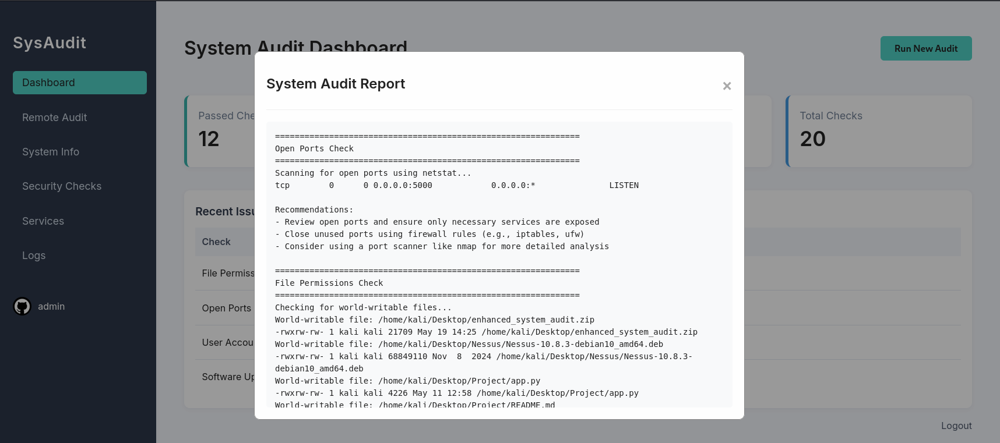
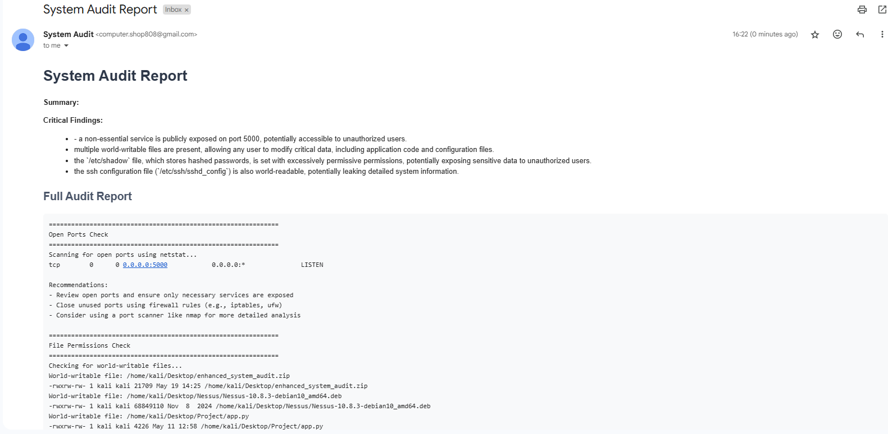

# 🤖 AI Linux Security Auditor

> A smart Flask-based web application for auditing Linux systems.  
> Combines traditional security checks with **AI-powered analysis** to deliver actionable insights, remote audit support, and email reporting—all through a sleek web dashboard.

---

## 🚀 Features

### 🔐 Password Security Checks
- Detects empty or default passwords
- Validates `/etc/shadow` file permissions
- Scans for plaintext passwords in config files
- Evaluates current password policy settings

### 📧 Email Report Delivery
- Prompts user for recipient email after audit
- Converts reports to **HTML** or **PDF**
- Sends formatted report as an email attachment
- Includes a brief summary in the email body

### 🤖 AI-Powered Analysis & Recommendations
- Analyzes audit results using **OpenAI API** or local rules
- Highlights critical findings
- Generates actionable recommendations
- Displays insights in the dashboard and email

### 🔒 Remote SSH Audit Support
- Audit remote Linux servers over SSH
- Supports password & key-based authentication
- Securely transfers and runs audit scripts
- Retrieves and analyzes remote results

---

## 📸 Screenshots

### 🖥️ Dashboard Interface

  
*Main dashboard showing system audit overview.*


### 📧 Email Report

  
*Example of the formatted email report with summary and attachment.*

---

## ⚙️ Setup Instructions

## Setup Instructions

1. Install the required dependencies:
```
pip install -r requirements.txt
```

2. Configure email settings in app.py:
```python
app.config['MAIL_SERVER'] = 'your_smtp_server'
app.config['MAIL_PORT'] = 587
app.config['MAIL_USERNAME'] = 'your_email@example.com'
app.config['MAIL_PASSWORD'] = 'your_app_password'
app.config['MAIL_DEFAULT_SENDER'] = ('System Audit', 'your_email@example.com')
```

3. (Optional) Set your OpenAI API key for enhanced AI analysis:
```python
os.environ['OPENAI_API_KEY'] = 'your-openai-api-key'
```

4. Run the application:
```
python app.py
```

5. Access the web interface at http://localhost:5000

## Usage

### Local Audit
1. Log in to the dashboard
2. Click "Run New Audit" to perform a local system audit
3. Review the results in the dashboard
4. Click "Send Report via Email" to send the report to your email

### Remote Audit
1. Navigate to the "Remote Audit" page from the sidebar
2. Enter the SSH connection details for the remote server
3. Run the audit and review the results
4. Send the report via email if desired

## Notes
- The application requires sudo privileges to run the audit script
- For remote audits, the SSH user must have sudo privileges on the remote server
- If not using OpenAI API, the system will fall back to local pattern-based analysis
- Email functionality requires valid SMTP server credentials

## Files
- `app.py`: Main Flask application
- `system_audit.sh`: Bash script that performs the system audit
- `audit_analyzer.py`: AI-powered analysis of audit reports
- `remote_audit.py`: Handles SSH connections and remote script execution
- `templates/`: HTML templates for the web interface

